# ОТЧЕТ

## Лабораторная работа №2: Кластеризация данных (K-средних и DBSCAN)

---

**Выполнил:** Джафари Хоссаин

**Дисциплина:** Современные инструменты анализа данных (СИАД)

**Дата:** 2025

---

## Цель работы

Целью работы является изучение и практическое применение двух алгоритмов кластеризации: **K-Means (K-средних)** и **DBSCAN**. Работа включает генерацию синтетических данных, применение алгоритмов к синтетическим и реальным данным (Clustering Penguins Species), сравнение эффективности методов и анализ влияния параметров.

---

## Краткое описание использованных методов кластеризации

### 1. K-Means (K-средних)

**K-Means** — итеративный центроидный алгоритм кластеризации. Алгоритм работы:
1. Инициализация K центроидов
2. Назначение каждой точки ближайшему центроиду
3. Пересчет позиций центроидов как среднее точек в кластере
4. Повторение шагов 2-3 до сходимости

**Особенности:** требует заранее задать число кластеров K, предполагает сферическую форму кластеров, все точки распределяются по кластерам, быстро работает, чувствителен к выбросам.

**Метрики:** инерция (сумма квадратов расстояний до центроидов), коэффициент силуэта (от -1 до 1). Методы подбора K: метод локтя и коэффициент силуэта.

### 2. DBSCAN

**DBSCAN** — алгоритм кластеризации на основе плотности. Основные понятия:
- **Точка ядра**: в окрестности (радиус eps) находится не менее min_samples точек
- **Граничная точка**: в окрестности точки ядра, но не является точкой ядра
- **Точка шума**: не является ни точкой ядра, ни граничной

**Параметры:** eps (максимальное расстояние между точками кластера), min_samples (минимальное число точек для кластера).

**Особенности:** автоматически определяет число кластеров, может находить кластеры произвольной формы, устойчив к выбросам, требует тщательного подбора параметров, чувствителен к масштабу признаков.

---

## Описание процесса генерации данных и применения методов

### 1. Синтетические данные (make_blobs)

**Генерация:** датасет создан с помощью `make_blobs` (scikit-learn): 1000 точек, 2 признака, 4 кластера, cluster_std=1.0, random_state=42.

**K-Means:**
- Кластеризация с K=4: инерция 1948.73, силуэт 0.792
- Подбор оптимального K (от 2 до 8): метод локтя и силуэт подтвердили K=4

**DBSCAN:**
- Масштабирование данных (StandardScaler)
- Параметры: eps=0.3, min_samples=5
- Результат: 3 кластера (вместо 4), силуэт 0.738

### 2. Реальный датасет (Clustering Penguins Species)

**Предобработка:**
- Загрузка из `penguins.csv`: 344 строки, 5 столбцов
- Выбор числовых признаков (4): culmen_length_mm, culmen_depth_mm, flipper_length_mm, body_mass_g
- Удаление пропусков и аномалий: итого 340 строк
- Масштабирование (StandardScaler)

**K-Means:**
- Подбор K: метод локтя — K=2 или K=3, силуэт — K=2 (0.532)
- Выбрано K=3 (соответствует 3 видам пингвинов)
- Результат: распределение 131, 123, 86 точек, инерция 373.93, силуэт 0.451

**DBSCAN:**
- Параметры: eps=0.5, min_samples=5
- Результат: 4 кластера, 67 точек шума (19.7%), силуэт 0.424
- Эксперименты: перебор eps [0.3-0.7] и min_samples [3,5,7,10], визуализация тепловых карт

---

## Визуализация результатов

### Синтетические данные

#### 1. Исходные данные с истинными кластерами

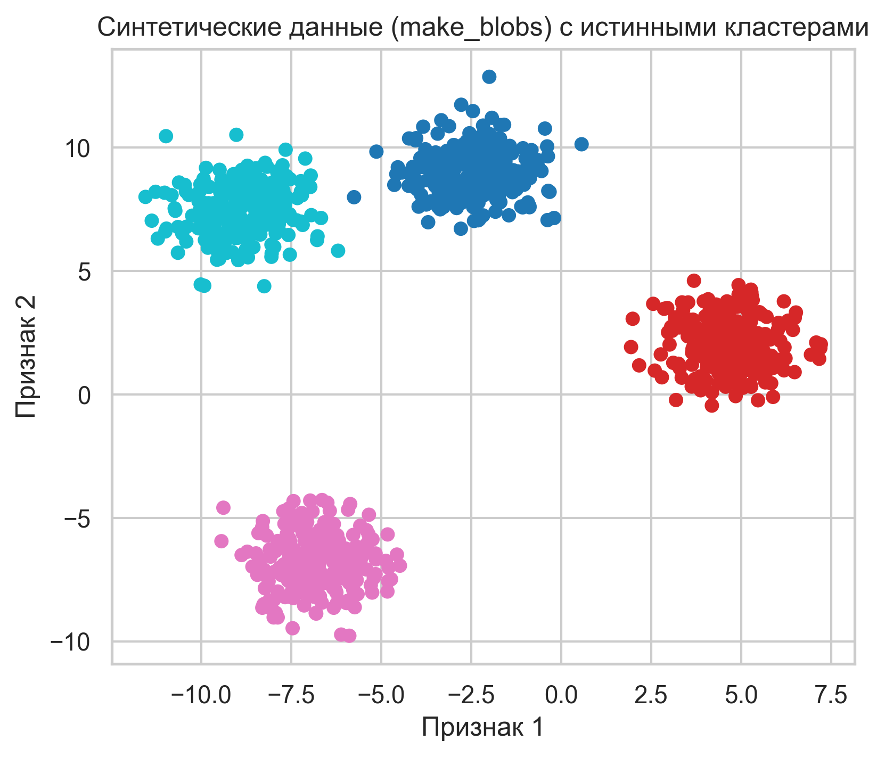

*Рисунок 1: Синтетические данные (make_blobs) с истинными кластерами. Видны 4 четко разделенных сферических кластера.*

#### 2. Результаты K-Means

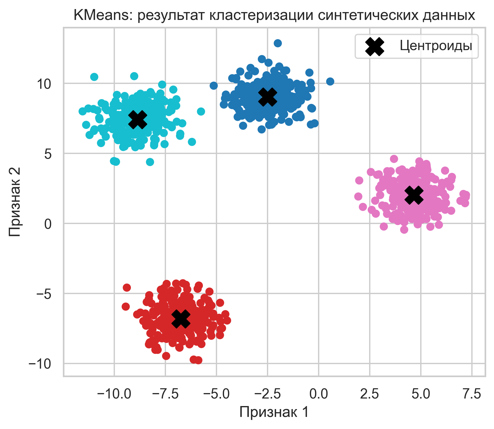

*Рисунок 2: Результат кластеризации K-Means на синтетических данных. 4 кластера с центроидами (черные крестики), коэффициент силуэта 0.792.*

#### 3. Метод локтя и коэффициент силуэта для K-Means

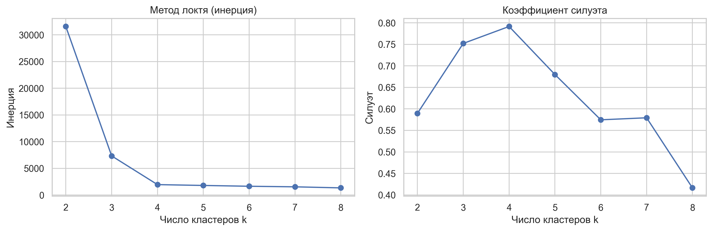

*Рисунок 3: Подбор оптимального числа кластеров для K-Means. Слева: метод локтя (инерция), справа: коэффициент силуэта. Оба метода подтверждают оптимальность K=4.*

#### 4. Результаты DBSCAN

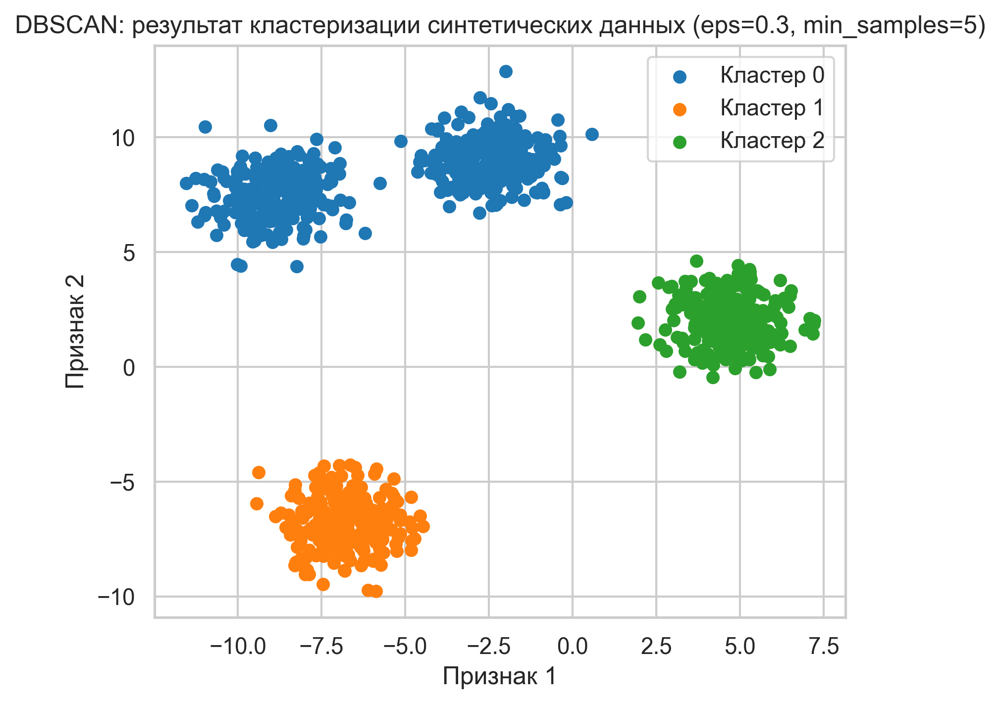

*Рисунок 4: Результат кластеризации DBSCAN на синтетических данных. Найдено 3 кластера (вместо 4), точки шума отмечены черным цветом, коэффициент силуэта 0.738.*

### Датасет Penguins

#### 1. Предварительный анализ данных

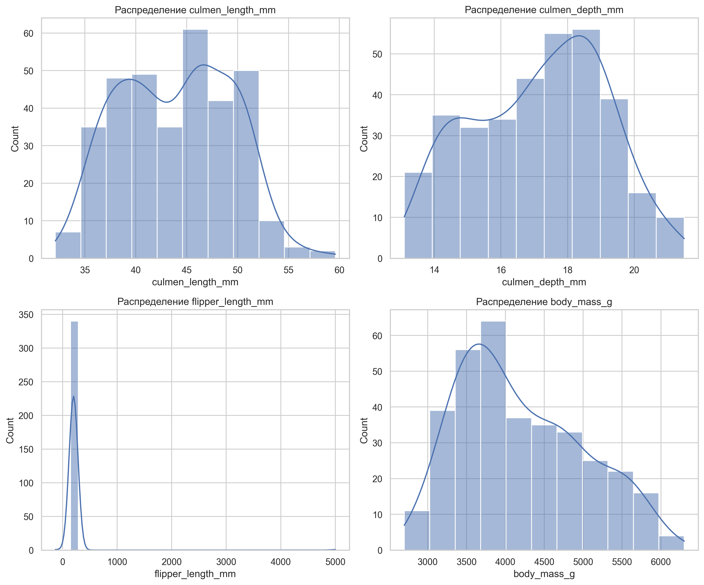

*Рисунок 5: Распределения числовых признаков датасета penguins.*

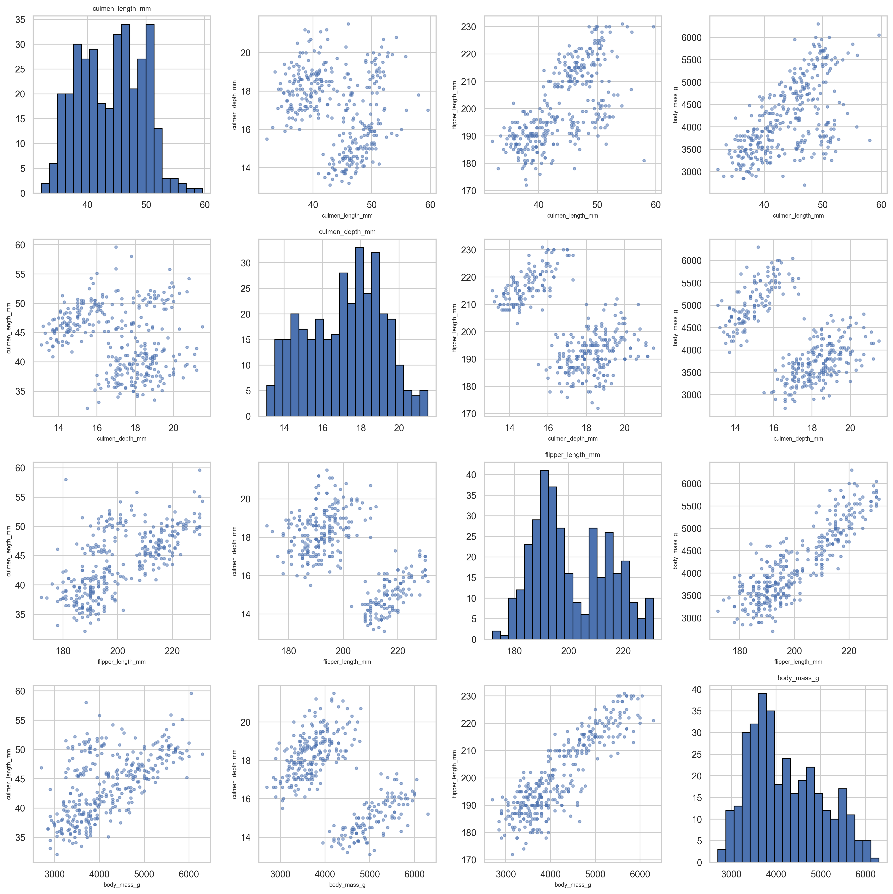

*Рисунок 6: Матрица scatter plots для пар признаков датасета penguins.*

#### 2. Результаты K-Means

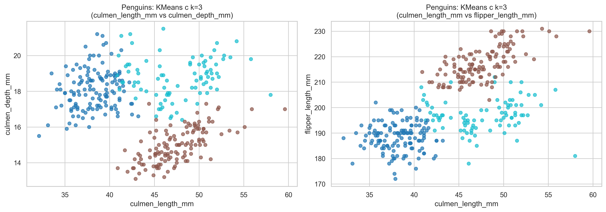

*Рисунок 7: Результат кластеризации K-Means на данных penguins. 3 кластера, хорошо разделены в пространстве признаков, коэффициент силуэта 0.451.*

#### 3. Метод локтя и коэффициент силуэта для K-Means

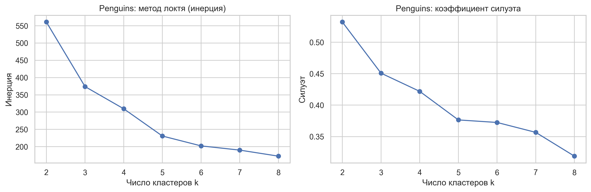

*Рисунок 8: Подбор оптимального числа кластеров для K-Means на данных penguins. Метод локтя указывает на K=2 или K=3, коэффициент силуэта максимизируется при K=2 (0.532).*

#### 4. Результаты DBSCAN

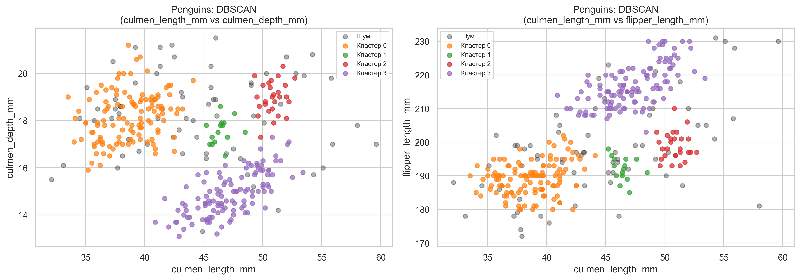

*Рисунок 9: Результат кластеризации DBSCAN на данных penguins. Найдено 4 кластера, 67 точек шума (19.7%), коэффициент силуэта 0.424.*

#### 5. Эксперименты с параметрами DBSCAN

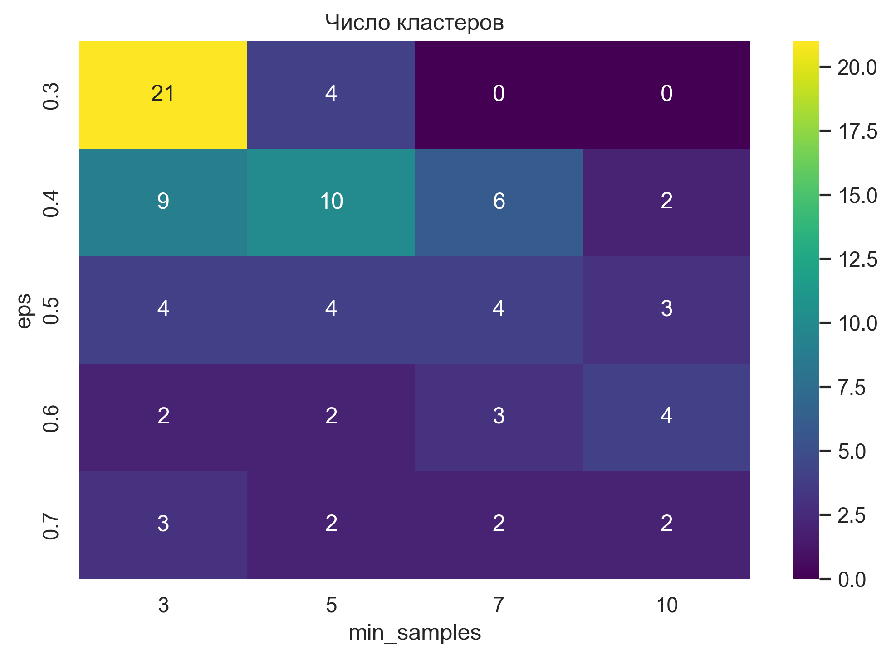

*Рисунок 10: Тепловая карта числа кластеров в зависимости от параметров eps и min_samples для DBSCAN.*

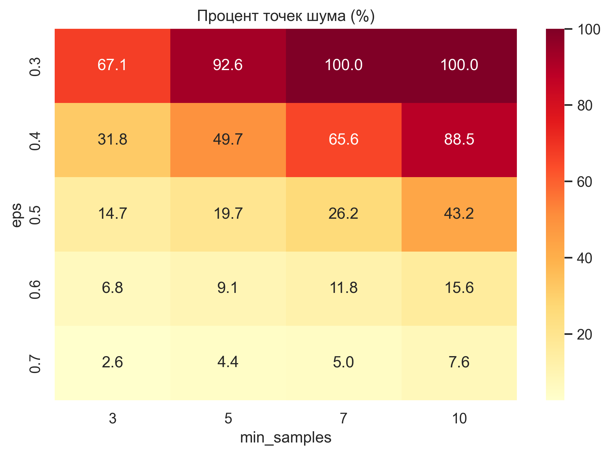

*Рисунок 11: Тепловая карта процента точек шума в зависимости от параметров eps и min_samples для DBSCAN.*

---

## Анализ результатов и сравнение эффективности методов

### Синтетические данные

**K-Means:** успешно восстановил 4 кластера (силуэт 0.792), все точки распределены, отличные результаты для сферических кластеров.

**DBSCAN:** нашел 3 кластера вместо 4 (силуэт 0.738), некоторые кластеры объединились, требуется более тщательный подбор параметров.

**Вывод:** K-Means превосходит DBSCAN на синтетических данных со сферическими кластерами.

### Датасет Penguins

| Метрика | K-Means | DBSCAN |
|---------|---------|--------|
| Число кластеров | 3 | 4 |
| Коэффициент силуэта | 0.451 | 0.424 |
| Инерция | 373.93 | - |
| Точки шума | 0 (0%) | 67 (19.7%) |
| Соответствие ожидаемому | Да (3 вида) | Нет |

**K-Means:** показал лучшие результаты, нашел ожидаемое число кластеров (3 вида), хорошая интерпретируемость.

**DBSCAN:** нашел больше кластеров, высокий процент шума, низкий силуэт, неравномерное распределение.

**Вывод:** K-Means показал лучшие результаты по метрике силуэта и интерпретируемости.

### Общее сравнение методов

**K-Means:**
- ✅ Простота использования, быстрая работа, все точки в кластерах
- ❌ Требует задать K, не находит кластеры произвольной формы, чувствителен к выбросам

**DBSCAN:**
- ✅ Автоматически определяет число кластеров, находит кластеры произвольной формы, устойчив к выбросам
- ❌ Требует подбора параметров, чувствителен к масштабу, может помечать много точек как шум

**Рекомендации:**
- **K-Means:** когда известно число кластеров, сферическая структура, нужна скорость
- **DBSCAN:** когда число кластеров неизвестно, произвольная форма, важно выявить выбросы

---

## Выводы

1. **На синтетических данных:** K-Means успешно восстановил структуру (4 кластера, силуэт 0.792). DBSCAN показал менее точные результаты (3 кластера), требует настройки параметров.

2. **На датасете Penguins:** K-Means показал лучшие результаты (силуэт 0.451, 3 кластера). DBSCAN нашел 4 кластера с низким качеством (силуэт 0.424, 19.7% шума).

3. **Общие выводы:** для данных с известной структурой предпочтительнее K-Means. K-Means лучше для сферических кластеров. DBSCAN полезен для автоматического определения числа кластеров, но требует настройки. Оба метода требуют масштабирования данных.

4. **Практические рекомендации:** использовать оба метода и сравнивать результаты. Для K-Means важно правильно подобрать K. Для DBSCAN необходим систематический перебор параметров. Масштабирование критично для обоих методов.

---

**Работа выполнена индивидуально.**

**Дата выполнения:** 2025

